# Smart Email Support for Telecom Organisations - Provide automated customer support for emails

Providing customer support in a timely manner is very important to enhance customer experience. Organisations receive communication, from their customers, through various channels like emails, phone calls, applications etc. Organisations need to understand the intent and content of each of the communication and ask customers for any additional information required to fulfil their requests. Manually processing each email request requires a lot of time to go through the emails, understand them and respond to them in a quick and appropriate manner. Additionally, manual processing is error prone. Delay in acting on customer requests could affect customer satisfaction levels. This code pattern addresses these issues. It will demonstrates Watson’s ability to automate email responses that are related to business processes. Customers will benefit from more timely responses and clear instructions for what information is needed in order to fulfill their requests.

In this code pattern we take use cases of a telecom domain customer support who need to action upon email requests they receive from customer. We will consider request scenarios for **enabling a service**, **disabling a service**, **changing plan** and **Adding family member to plan**.

As a customer support, one should
- Know intent of email.
- Know information available in these emails.
- Identify information that is missing.
- Auto-compose responses and send emails.

This code pattern provides an automatic and cognitive way of achieving the above requirements. It uses natural language processing of emails, understanding intents of emails, auto composing responses and providing a dashboard with high level summary of intents and emails. While the use case demonstrated here is for a telecom domain, it can be applied to any domain. It integrates with database, which acts as a CRM, to pull customer information to validate emails and requests. It uses Watson Knowledge Studio for custom domain natural language processing, Watson Natural Language Understanding(NLU) to deploy custom domain model and get entities from emails, Watson Natural Language Classifier(NLC) to get intent of email, IBM Cloudant database to store emails and customer data, Node-RED to integrate with emails, Watson services and IBM Cloudant database, Node runtime for user interface application.

After completing this pattern, you will learn how to:
- Build a custom model using Watson Knowledge Studio and deploy it on Watson Natural Language Understanding.
- Build a Node-RED flow that integrates email server, Watson services (NLU and NLC) and IBM Cloudant database.
- Deploy application, send sample customer emails and see the emails being auto processed using a simple user interface.


# Watch the Overview Video

[](https://youtu.be/AT477px19gQ)


# Flow
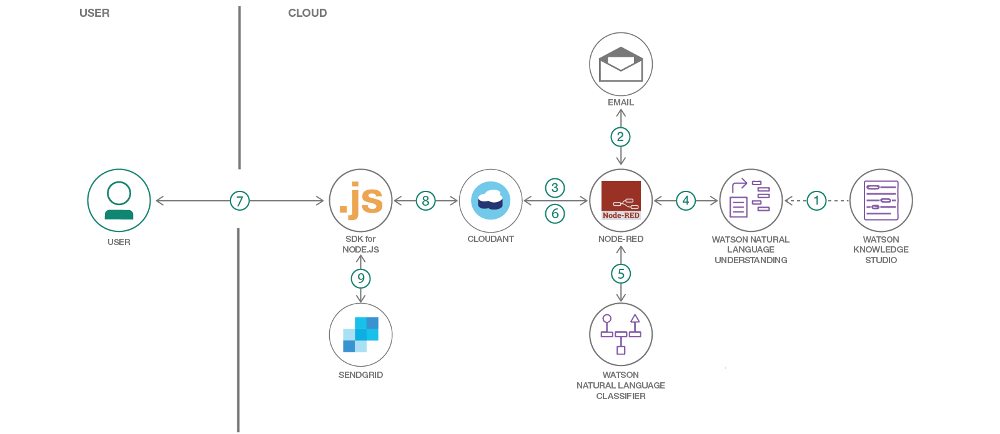

1. Deploy custom model, built for telecom use cases using Watson Knowledge Studio, to Watson Natural Language Understanding.
2. Node-RED flow gets (polls) for customer emails and retrieves them.
3. Customers are validated by matching customer email id and customer data available in Cloudant database for customer records.
4. Information (entities like name, phone number) in emails are identified using Watson NLU.
5. Intent (or service request type) of email is identified using Watson NLC.
6. Email content, entities, intent are saved in Cloudant email database for each request.
7. Customer support user accesses nodejs application deployed on IBM cloud.
8. Application fetches emails, entities and intents from Cloudant email database.
9. Responses to email are auto populated (auto composed) and customer support user can just click the send button to send response to customer.


## Included components

* [Watson Knowledge Studio](https://console.bluemix.net/docs/services/knowledge-studio/index.html#wks_overview_full): Use IBM Watson™ Knowledge Studio(WKS) to create a machine-learning model that understands the linguistic nuances, meaning, and relationships specific to your industry or to create a rule-based model that finds entities in documents based on rules that you define.
* [Watson Natural Language Understanding](https://www.ibm.com/watson/services/natural-language-understanding/): A IBM Cloud service that can analyse text to extract meta-data from content such as concepts, entities, keywords, categories, sentiment, emotion, relations, semantic roles, using natural language understanding.
* [Watson Natural Language Classifier](https://www.ibm.com/watson/services/natural-language-classifier/): The Natural Language Classifier service applies cognitive computing techniques to return the best matching classes for a sentence or phrase.
* [Node-RED](https://console.bluemix.net/docs/starters/Node-RED/nodered.html#nodered): Node-RED provides a browser-based flow editor that makes it easy to wire together devices, APIs, and online services by using the wide range of nodes in the palette.
* [SDK of Node.js](https://console.bluemix.net/docs/runtimes/nodejs/index.html#nodejs_runtime): The Node.js runtime on IBM® Cloud is powered by the sdk-for-nodejs buildpack. The sdk-for-nodejs buildpack provides a complete runtime environment for Node.js apps.
* [IBM Cloudant](https://console.bluemix.net/catalog/services/cloudant): IBM Cloudant is a fully managed JSON document database.


## Featured technologies

* [Natural Language Processing](https://machinelearningmastery.com/natural-language-processing/): the ability of a computer program to understand human language as it is spoken. NLP is a component of Artificial Intelligence.
* [Artificial Intelligence](https://www.computerworld.com/article/2906336/emerging-technology/what-is-artificial-intelligence.html): Intelligence demonstrated by machines, in contrast to the natural intelligence displayed by humans.


## Prerequisites
- If not already installed, [download and install git](https://git-scm.com/downloads).
- If not already installed, [install IBM Cloud CLI](https://console.bluemix.net/docs/cli/reference/ibmcloud/download_cli.html#install_use).
- Familiarity with basic concepts of [Node-RED](https://nodered.org/docs/).

> Create all the resources in the same region, organisation and space so that there will be no issues in accessing the services.
> Whenever you login to IBM Cloud from command prompt, ensure that you log into the right region, organisation and space by running the command `ibmcloud target`.

## Steps
Follow these steps to setup and run this code pattern. The steps are described in detail below.
1. [Clone git repo](#1-clone-git-repo)
2. [Deploy WKS model to NLU](#2-deploy-wks-model-to-nlu)
3. [Create IBM Cloudant databases](#3-create-cloudant-databases)
4. [Create NLC Service Instance](#4-create-nlc-service-instance)
5. [Setup and deploy Node-RED flow](#5-setup-and-deploy-node-red-flow)
6. [Setup SendGrid service](#6-setup-sendgrid-service)
7. [Deploy application and send emails](#7-deploy-application-and-send-emails)
8. [Run the application](#8-run-the-application)


## 1. Clone git repo
- On command prompt run the below command to clone the git repo.
```
git clone git@github.com:IBM/smart-email-support.git
```
or
```
git clone https://github.com/IBM/smart-email-support.git
```
run `cd smart-email-support` to change directory to project parent folder


## 2. Deploy WKS model to NLU

### 2.1 Create NLU service
- [Create NLU service Instance](https://console.bluemix.net/catalog/services/natural-language-understanding).
- Enter any name that you like. For this code pattern we have service name as `wbc-Natural Language Understanding`.

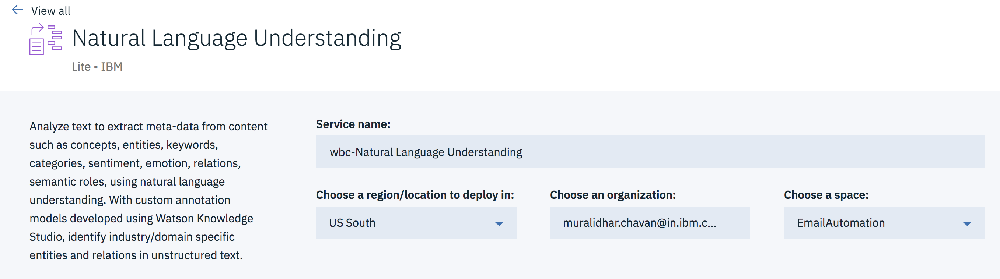

- Select appropriate region, organization and space. Select `Free` plan and click `Create`.
- Click `Show Credentials` and save `Username` and `Password` in a file.

### 2.2 Create WKS service instance and build model
- [Create WKS service instance](https://console.bluemix.net/catalog/services/knowledge-studio).
- Enter any name that you like. For this code pattern we have service name as `wbc-Knowledge Studio`.

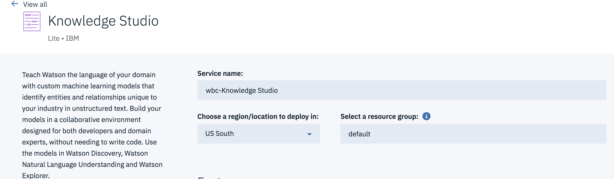

- Select appropriate region and resource group. Select `Lite` plan and click `Create`.
- Go to IBM Cloud dashboard. Click on the WKS service instance created in previous step. Click on `Launch Tool`.
- Click on `Create Workspace`. Enter a name for workspace and click `Create`.
- In WKS tool left side-bar navigation, go to `Assets` -> `Entity types`. Click `Upload`. Click on the icon  and browse to WKS folder in the cloned git repo and select `types-e9.json` file and click `Open`. Then click `Upload`. Entity types should be populated.
- Navigate to `Assets` -> `Documents`. Click on `Upload Document Sets`. Click on the icon  and browse to WKS folder in the cloned git repo and select corpus-e9.zip file. Let the options selected be default. click `Upload`. Document sets should be loaded.
- In WKS tool left side-bar navigation, go to  `Machine Learning Models` -> `Performance`. Click `Train and Evaluate`.

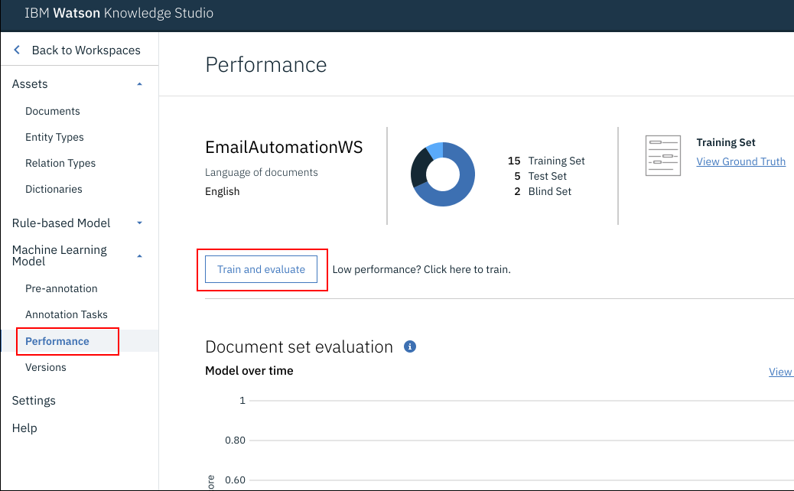

- Select `All` under `Document Set` and click on `Train and Evaluate`. Training will commence and can be seen at the top right corner of the screen which shows the message `Train Processing...`. This process will take about 10 minutes to complete the training process.

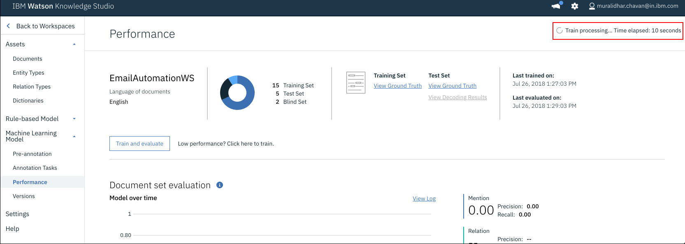

- When the training is done it should display a message `Machine Learning Model Evaluation Complete`.
- Navigate to `Machine Learning Models` -> `Versions`. Click `Take Snapshot`. Enter `Description` (optional) and click `OK`


- Click `Deploy`. Select `Natural Language Understanding`. Click `Next`. Select appropriate region and space. From the Service name drop down select the NLU instance that was created in [section](#21-create-nlu-service). Click `Deploy`.
- When deployed make a note of the model id. Click `OK`.


## 3. Create Cloudant databases
- Create IBM Cloudant service instance on IBM Cloud using this [link](https://console.bluemix.net/docs/services/Cloudant/tutorials/create_service.html#creating-an-ibm-cloudant-instance-on-ibm-cloud). Select `Use both legacy credentials and IAM` when asked for authentication method.  While creating database you can use any name to create. For this code pattern we have considered `wbc-Cloudant`. Make a note of Cloudant Service credential username and password. Update username and password in <project_parent_folder>/manifest.yml file against keys `cloudant_username` and `cloudant_password`.
- Create email database
  - On IBM Cloud dashboard, click the Cloudant service instance created in above step. On the left navigation bar of the service instance, click `Manage`. Then click `Launch Cloudant Dashboard`.
  - On the top right side of the screen, click on `Create Database`.
  - Enter the name of the database as **email** and click `Create`.
- Create Customer database
  - On the left navigation bar of the service instance, click `Manage`. Then click `Launch Cloudant Dashboard`.
  - On the top right side of the screen, click on `Create Database`.
  - Enter the name of the database as **customer_data** and click `Create`.
  - Populate customer data by following the below steps
    - In Cloudant dashboard, click on `databases`.
    - Click on `customer_data` database
    - On the right top corner click on `Create Document`.
    - Then add customer data in the following format.

    > Only \_id, first_name, last_name, email and phone_no are mandatory

    ```
    {
      "_id": "<email id of customer>",
      "first_name": "<first name of customer>",
      "last_name": "<last name of customer>",
      "email": "<email id of customer>",
      "phone_no": "<phone number of customer>",
      "plan": "<plan of customer>",
      "family": [
        {
          "first_name": "<first name of family member, if any>",
          "last_name": "<last name of family member, if any>",
          "phone_no": "<phone number of family member>",
        }
      ],
      "services": [
        "MCA",
        "News"
      ]
    }
    ```
    e.g
    ```
    {
      "_id": "firstname.lastname@gmail.com",
      "first_name": "FirstName",
      "last_name": "LastName",
      "email": "firstname.lastname@gmail.com",
      "phone_no": "1234567890",
      "plan": "Infinity"
    }
    ```

    Similarly add all customer details who will send email requests.

## 4. Create NLC Service Instance
- [Create Watson NLC](https://console.bluemix.net/catalog/services/natural-language-classifier) service instance.
- Enter any name that you like. For this code pattern we have service name as `wbc-Natural Language Classifier`.

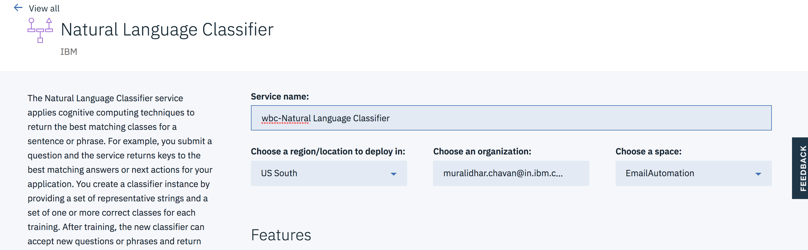

- Select appropriate region, org and space and click `Create`.
- Click `Show Credentials` and make a note of `Username` and `password`.
- In a command prompt, change directory to ``<git repo parent folder>/NLC``
- Run the below command after updating *Username* and *password* with NLC service instance's username and password noted in previous step.
```
curl -i --user <username>:<password> -F training_data=@./Intent_training.csv -F training_metadata="{\"language\":\"en\",\"name\":\"NLClassifier\"}" "https://gateway.watsonplatform.net/natural-language-classifier/api/v1/classifiers"
```
- The NLC service instance will be trained with the training data *Intent_training.csv*. The command is executed with a information saying that it'll take sometime to train NLC. It takes a few minutes to train NLC.
- Get classifier id using the command
```
curl -u <username>:<password>  "https://gateway.watsonplatform.net/natural-language-classifier/api/v1/classifiers"
```
- Make a note of *classifier_id*.


## 5. Setup and deploy Node-RED flow

### 5.1 Create Node-RED service
- Click [Create Node-RED service instance](https://console.bluemix.net/catalog/starters/node-red-starter) to create an instance of Node-Red.
- Enter any name that you like. For this code pattern we have service name as `wbc-node-red`.

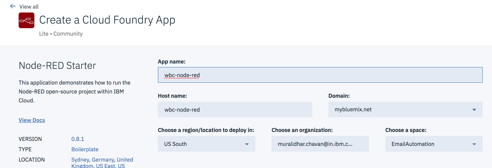

- Select appropriate region, org and space and click `Create`.
- The service should get created.


### 5.2 Deploy Node-RED flow
- Import Node-Red flow
  - In the cloned project folder, navigate to `Node-RED` folder and open the contents of the file `node-red-flow.json` in a text editor.
  - Copy the contents (to clipboard).
  - In IBM Cloud dashboard click on Node-RED service created in the above [section](#51-create-node-red-service).
  - Click on `Visit App URL`.
  - On the `Welcome to your new Node-RED` page click `next`.
  - To secure your editor enter your `username` and `password`.
  - Click `Next` twice and click `Finish`.
  - Node-RED application is created. On the application page click on `Go to your Node-RED flow editor`.
  - Enter `username` and `password` that was created in a couple of steps earlier and click `Next`.
  - In the flow editor top right corner click on three horizontal bars.
  - Navigate to `Import` and then click on `clipboard`
  - Paste the copied content here and click on `Import` button.
  - The Node-RED flow is now imported.
- Update email and service details in Node-RED flow.
  - Email Node
    - Double click to open `FromEmail` node. Update `Userid` and `Password` fields here. This is the customer support email id which needs to be monitored by organisations to receive emails from customers. For this code pattern, you can use your existing email id or create a new email account with gmail and provide the details here. Also, if required, update the refresh rate, which is in seconds, so that the node will look for new emails at regular intervals. The imported flow has a refresh rate of 360 seconds or 6 minutes. Click `Done`.
  - Customer Data Search node
    - Double click on `customer_data_search` node.
    - Click the edit button against the field `Server`.
    - Enter Cloudant database service instance's `Host`, `Username` and `Password` and click `Update`. Click `Done`.
  - Add Model Id node
    - Next we will need to update the Model Id of the WKS model that was deployed on NLU. Copy that model id to clipboard.
    - Double click `Add Model Id` node and update the model id against `msg.nlu_options.entity_model`. Click `Done`.
  - NLU Node
    - Double click on `nlu` node and specify NLU service instance credentials and click on `Done`.
  - NLC Node
    - Double click on `NLClassifier` node. Update NLC credentials. Update classifier_id as noted in [this section](#4-create-nlc-service-instance). Click `Done`.
  - Email db cloudant node
    - Double click on `email db cloudant node`.
    - Click the edit button against the field `Server`.
    - Enter Cloudant database service instance's `Host`, `Username` and `Password` and click `Update`. Click `Done`.
- Deploy Node-RED flow and check if it is working fine.
  - Click on `Deploy` on the top right corner of the screen.
  - Send an email from your email id (which acts as customer email - ensure that this email details are updated in customer_data database) to customer support email id as updated in FromEmail node of Node-RED.
  - Ensure that the Node-RED flow is executed and that debug messages are printed. Check this [link](https://nodered.org/docs/user-guide/nodes#debug) to find more details on debug node.
  - Populate the email database, by sending few emails with requests for *Plan Change*, *Enable Service*, *Disable Service*, *Add Family Member to plan*. Suggest you to send few emails with different intents. Ensure that sender emails ids are available in customer_data database of Cloudant.


## 6. Setup SendGrid service
Sendgrid service is used to send emails from our application to customers.
- Create an instance of sendgrid [here](https://console.bluemix.net/catalog/services/sendgrid). Select free plan.
- Create sendgrid apikey using this [link](https://sendgrid.com/docs/ui/account-and-settings/api-keys/).
- Update sendgrid api key in <project_root>/manifest.yml file against the key *sendgrid_api_key*.
- In <project_root>/manifest.yml, from email id is provided. User is free to change this email id to any email id they wish to, provided they have password for it.

## 7. Deploy application and send emails
- Go to the cloned project parent folder. In command prompt, change directory to cloned project parent folder using command `cd smart-email-support`.
- Open manifest.yml in any text editor.
- Under **services** update the Cloudant service instance name.
- On command prompt, login to IBM Cloud using `ibmcloud login` or `ibmcloud login --sso` (for federated login).
- Run the below command to deploy the application to IBM Cloud.
```
ibmcloud cf push
```
- Check the logs of the application using the command `ibmcloud cf logs <app_name> --recent`.
- Ensure that the application is deployed to IBM Cloud successfully. If you see any errors in logs, fix them and redeploy the application.


## 8. Run the application
- Login to IBM Cloud and go to dashboard. There you will see that the application is deployed and running.
- Click on the application and click on `Visit App URL`.
- The application home page opens.

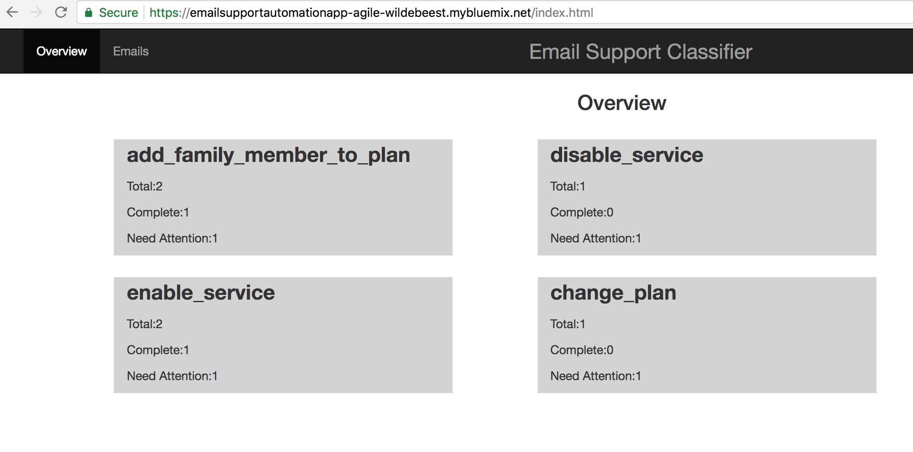

- The home page shows a dashboard containing intents of emails, and for each intent it shows number of emails, completed emails and emails that need attention.
- If there are no emails, then the home page shows a blank page. Send few emails, as instructed in [this section](#52-deploy-node-red-flow), with different intents so that there is some data to get populated in the application.
- Click on emails link, shown in below image, to see list of emails

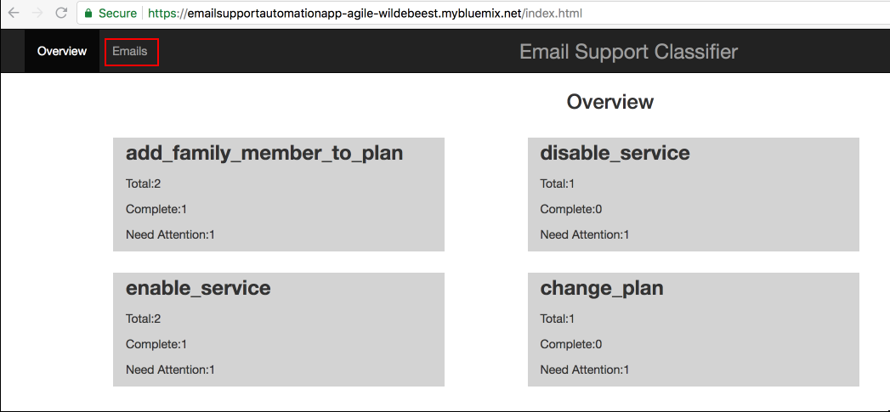

- Below image shows the table of emails. It shows *timestamp*, *subject*, *status* and *text*

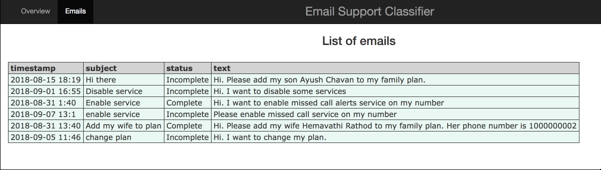

- Click on any row to get more details

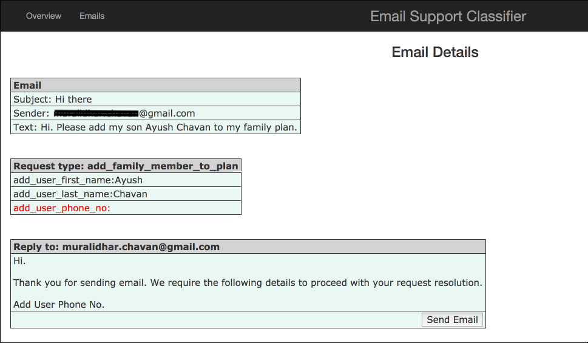

Here you can see what all entities were identified and what all entities are missing

- Responses to emails are auto composed. User can just click the send button to send response to customer. Ensure that the email is received on customer email id.

> Editing auto composed email is not provided in this code pattern while the user can use this code pattern to implement this feature

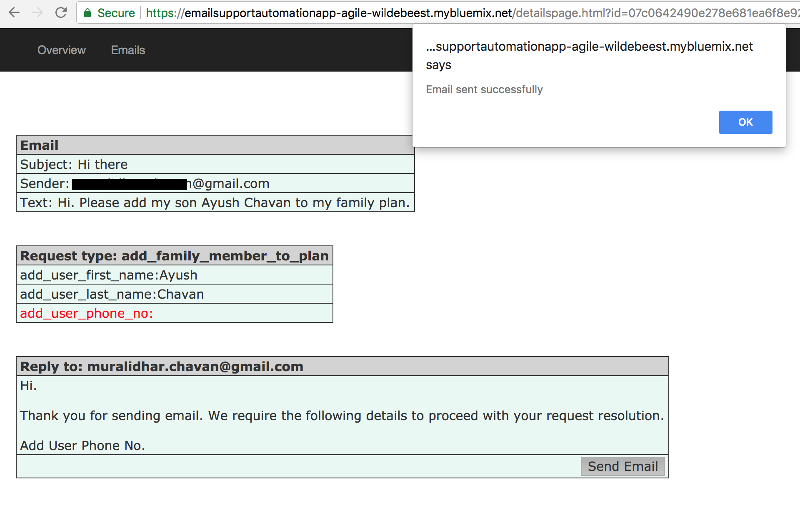

That concludes the flow of the application.


# Summary
We saw that emails sent by customers are categorised into different intents. Emails are parsed to identify information available in emails. Missing information, if any, is identified. Email responses are auto composed and customer support representative can just click a button to send the auto composed email. We used WKS to build a custom model and deployed it on NLU to extract entities from emails. We used NLC to get intents of emails, sendgrid to send email and Note-RED flow for process orchestration. We used a Node application to show the working of this use case.


# Troubleshooting
See [Debugging.md](./Debugging.md)


# License

This code pattern is licensed under the Apache Software License, Version 2. Separate third party code objects invoked within this code pattern are licensed by their respective providers pursuant to their own separate licenses. Contributions are subject to the Developer [Certificate of Origin, Version 1.1 (“DCO”)] (https://developercertificate.org/) and the [Apache Software License, Version 2]( (http://www.apache.org/licenses/LICENSE-2.0.txt).

ASL FAQ link: http://www.apache.org/foundation/license-faq.html#WhatDoesItMEAN